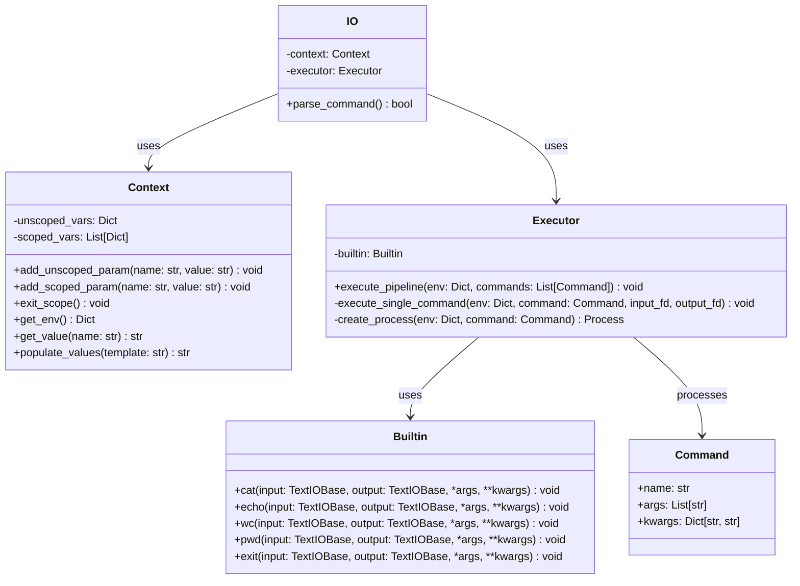

# Class Diagram

```mermaid
classDiagram
    class IO {
        -context: Context
        -executor: Executor
        +parse_command() bool
    }

    class Context {
        -unscoped_vars: Dict
        -scoped_vars: List[Dict]
        +add_unscoped_param(name: str, value: str) void
        +add_scoped_param(name: str, value: str) void
        +exit_scope() void
        +get_env() Dict
        +get_value(name: str) str
        +populate_values(template: str) str
    }

    class Executor {
        -builtin: Builtin
        +execute_pipeline(env: Dict, commands: List[Command]) void
        -execute_single_command(env: Dict, command: Command, input_fd, output_fd) void
        -create_process(env: Dict, command: Command) Process
    }

    class Builtin {
        +cat(input: TextIOBase, output: TextIOBase, *args, **kwargs) void
        +echo(input: TextIOBase, output: TextIOBase, *args, **kwargs) void
        +wc(input: TextIOBase, output: TextIOBase, *args, **kwargs) void
        +pwd(input: TextIOBase, output: TextIOBase, *args, **kwargs) void
        +exit(input: TextIOBase, output: TextIOBase, *args, **kwargs) void
    }

    class Command {
        +name: str
        +args: List[str]
        +kwargs: Dict[str, str]
    }

    IO --> Context : uses
    IO --> Executor : uses
    Executor --> Builtin : uses
    Executor --> Command : processes
```
